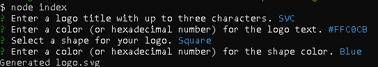
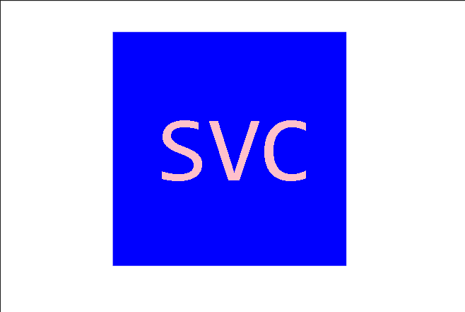

# Logo Generator

## Description

This is a command line application that generates a three (or less) letter logo as an .svg file.

The logo is generated through prompts in the command line.

Preview Images:

[Preview Video](https://drive.google.com/file/d/1YsFLW_rtCb3AmepBuuWbSZT6W6Hac6IA/view)

## Usage

From the command line enter 'node index' to run the application. Answer the following prompts; colors can be entered by typing out the color name or using a hex code.

The generated SVG file is located within the root directory.

## Contributors

1. Natasha Mann - Helped implement test/jest code.

2. https://www.w3schools.com/graphics/svg_polygon.asp - Tutorial on generating polygon (triangles) in SVG files.
